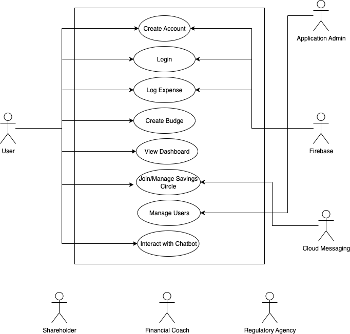
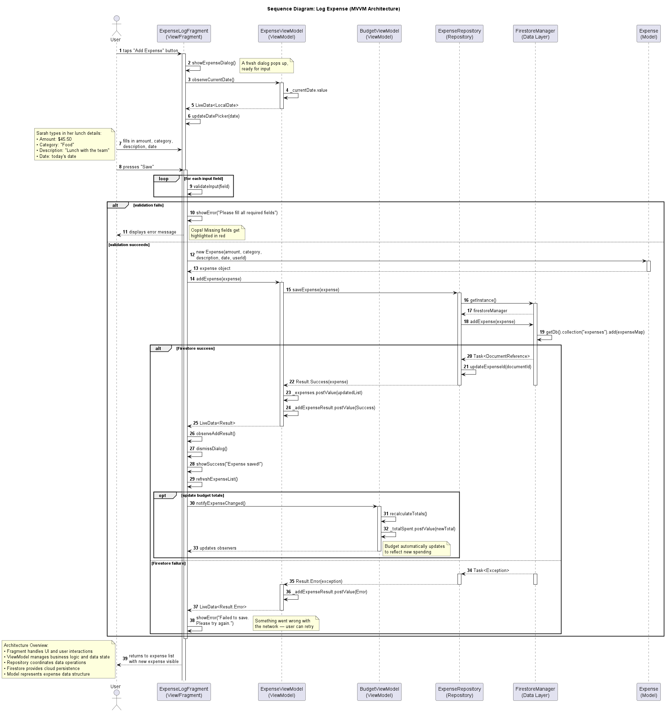

# FinTrack


An Android personal finance app featuring expense tracking, budget management, collaborative savings circles, and an AI-powered financial advisor chatbot.

Built by a 6-person team at Georgia Institute of Technology using MVVM architecture, Firebase, and the Hugging Face Inference API.

---

## Features

- **Authentication** — Secure register/login via Firebase Authentication
- **Expense Logging** — Track and categorize expenses with date-aware management and reminders
- **Budget Management** — Per-category budgets with real-time threshold alerts and warning dialogs
- **Savings Circles** — Collaborative group savings goals: invite members, log contributions, track progress toward a shared target
- **AI Financial Advisor** — Chatbot powered by Mistral-7B (Hugging Face Inference API):
  - Persistent conversation history stored in Firestore
  - Custom financial commands: spending summaries, cost-cutting suggestions, month-over-month comparisons
  - Context injection from previous conversations
- **Dashboard** — Unified financial overview with live data from all modules

---

## Tech Stack

| Layer | Technology |
|---|---|
| Platform | Android (Java, API 26+) |
| Architecture | MVVM + Repository pattern |
| Backend | Firebase Firestore, Firebase Authentication |
| AI | Hugging Face Inference API (Mistral-7B-Instruct) |
| HTTP | OkHttp |
| UI | Material Design 3 |
| Code quality | Checkstyle, SOLID/GRASP principles |

---

## Architecture

```
app/
├── model/          # POJOs and business entities
├── repository/     # Data access (Firestore + AI API)
├── viewmodel/      # LiveData-based state and business logic
├── view/           # Activities and Fragments (thin UI layer)
├── adapter/        # RecyclerView adapters
├── factory/        # ViewModel factories
├── strategy/       # Strategy pattern implementations
└── utils/          # Shared utilities
```

MVVM keeps views decoupled from data. Repositories abstract Firebase and external APIs behind a clean interface that ViewModels consume via LiveData, surviving configuration changes and simplifying testing.

---

## Design

### Use Case Diagram



### Domain Model


### Sequence Diagram — Log Expense



### Further Documentation

Supporting design and code-quality artifacts live in [`docs/`](docs/):

- [SOLID Principles write-up](docs/SOLID-Principles-Writeup.pdf) — applying the five SOLID principles to the codebase
- [SOLID & GRASP analysis](docs/SOLID_GRASP/) — class diagram, write-up, and a reference Java implementation
- [Code smells analysis](docs/Code_Smells/) — identified smells and refactorings
- [Group Savings sequence diagram](docs/SequenceDiagram_GroupSavings.drawio) — editable `.drawio` source

---

## Getting Started

### Prerequisites

- Android Studio Hedgehog or later
- Firebase project with Firestore and Authentication enabled
- Hugging Face account (free tier works)

### Setup

1. Clone the repo and open `Project/Sprint0.5-main/` in Android Studio.
2. Add your Firebase `google-services.json` to `app/`.
3. Add your Hugging Face API key to `Project/Sprint0.5-main/local.properties`:
   ```
   HUGGING_FACE_API_KEY=hf_your_key_here
   ```
4. Build and run on a device or emulator (API 26+).

See [API_KEY_SETUP.md](Project/Sprint0.5-main/API_KEY_SETUP.md) for full Hugging Face setup instructions.

---

## Team

Austin · Shreya · Yitian Yu · Bogdan Perlroth · Joseph Sherrier · Nehal Singhal
